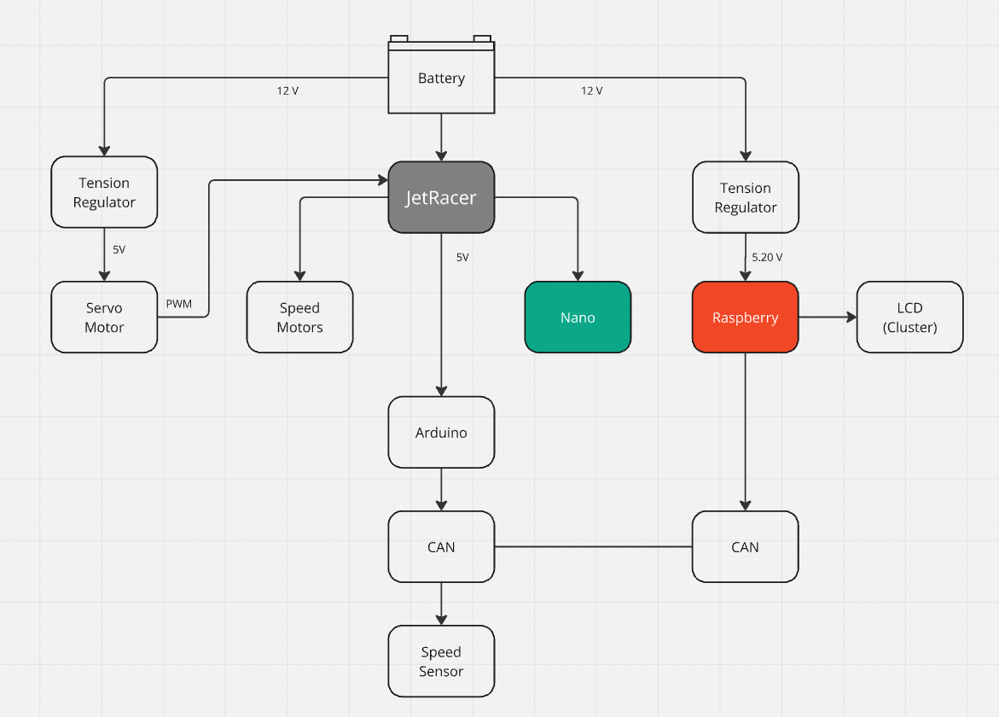
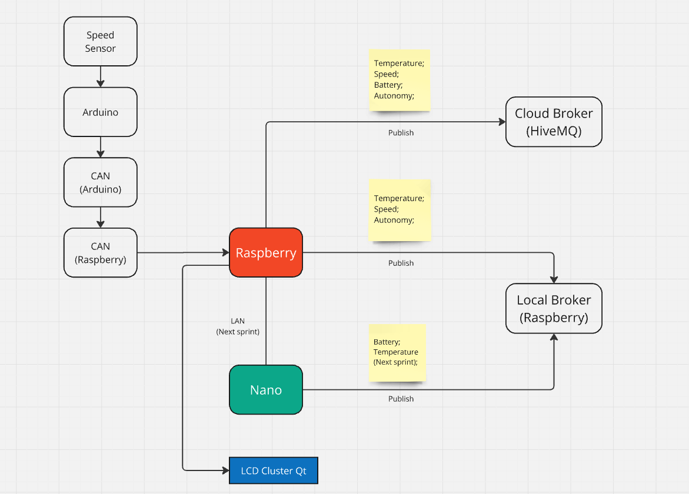

## Project Architecture

We implemented **Tensor Regulators** so that the servo motors of our **JetRacer** and our **Raspberry Pi** have the neccesary Voltage to function properly.

## Communication Structure

The Jetson communicates with the Raspberry via **mqtt**, with a **Cloud Broker** (HiveMQ) and a local Broker. We chose mqtt since its latency is pretty small, and it seems to get the job done well. The Raspberry is the one to display the information in the **LCD**, with informations of Jetson's temperature and battery, and  also information of the speed directly from the speed sensor, with arduino via CAN.

## Documentation and Results

For more documentation and visual results of our Qt app, go to [Digital Cluster README](/digital_cluster/README.md).

For more on our **CAN Communication, Arduino and Speed Sensor**, visit our [Arduino README](/arduino/README_arduino.md).

To view a more detailed and structured documentation, click on
[Doxygen Docs](https://seame-pt.github.io/DistributedEmbeddedSystems/).

## Test Coverage Report

To view our test coverage report access: [Test Coverage Report](https://seame-pt.github.io/DistributedEmbeddedSystems/coverage/index.html)

### [DES Project 1 - PiRacer Assembly](https://github.com/SEA-ME/DES_PiRacer-Assembly)

### [DES Project 2 - Instrument Cluster](https://github.com/SEA-ME/DES_Instrument-Cluster)
