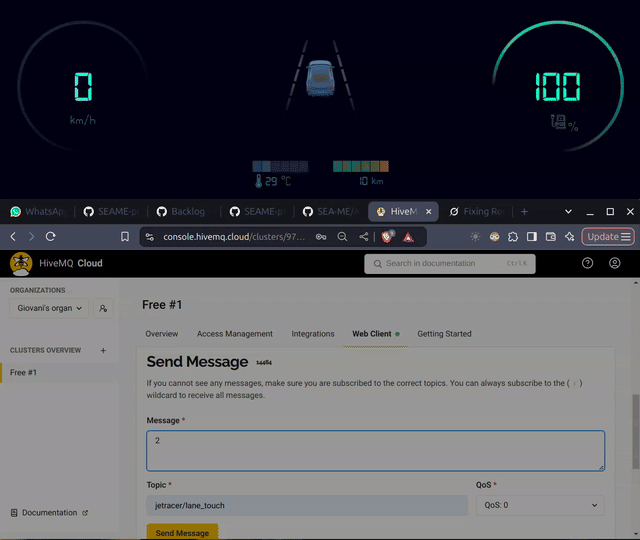

# Instrument Cluster

Our Digital Cluster receives updates from the **cloud** via MQTT.



## Compile and run with Cmake

To compile locally and view the cluster, you may need to install libraries such as QtMqtt. We recommend using Qt5 and installing QtMqtt from its source repository, the 5.13 version (specific branch).

Furthermore, if you are not in the same network as the jetracer, you should get our values through Cloud. Although, if you don't have access to our .env this will not work. Still, you can comment out the part of the code corresponding, and just view our cluster without real values. You can find the code specific to this matter in **src/mainwindow.cpp, init_mqtt()**.

If you are indeed in the same network, you can set the correct Hostname and port on the file mentioned above. You will also see the implementation and documentation of this matter in said file.

You may have some issues with the thread library so you may need to export it, in my device I do it like this:

```bash
export LD_PRELOAD=/lib/x86_64-linux-gnu/libpthread.so.0
```

If you have access to our .env and want to run it with Cloud, execute:

```bash
./automate_env.sh
```

If not, execute:

```bash
mkdir build
cd build
cmake ..
make
./digital_cluster
```

## Google Test

To view our gtests go to the **test** folder, to run them, execute the following:

```bash
./automate_test.sh
```

## Cross-compilation

To run this program on our jetracer, you should connect through localhost on mainwindow.cpp. After that, execute the following:

```bash
./automate_cross.sh
```

Keep in mind that if you don't know the password to our jetracer, you will not have access.

If you do have access, connect to the jetracer via ssh with the flag -X (enabling X11 forwarding) to support GUI (graphical user interface). On the other hand, if you just want to display it directly on the jetracer you can skip this step.

Now, to display either on your device, or directly in the jetracer you have to run the following on the jetracer, or through the ssh connection:

```bash
cd qt_cluster
docker-compose build
docker-compose up
```

<a href="https://www.flaticon.com/free-icons/ev" title="ev icons">Ev icons created by Vichanon Chaimsuk - Flaticon</a>

<div> Icons made by <a href="https://www.freepik.com" title="Freepik"> Freepik </a> from <a href="https://www.flaticon.com/" title="Flaticon">www.flaticon.com'</a></div>
